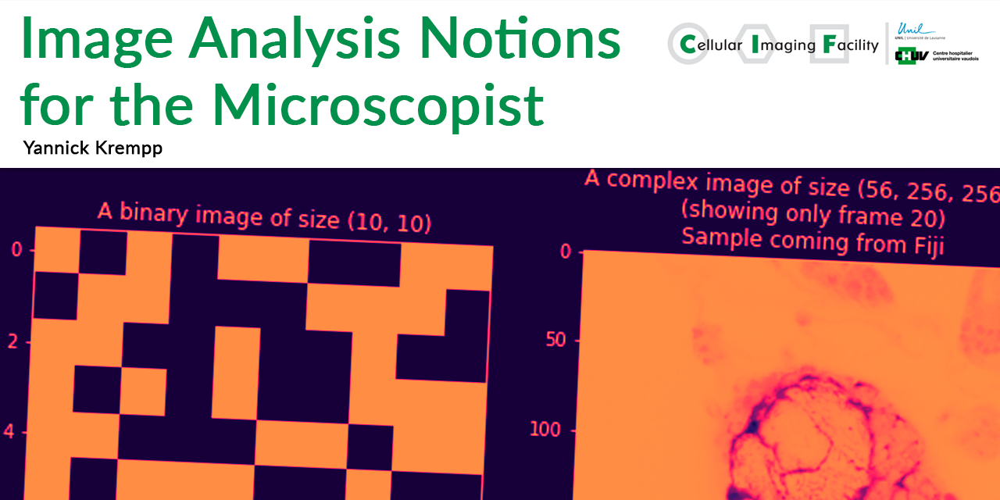
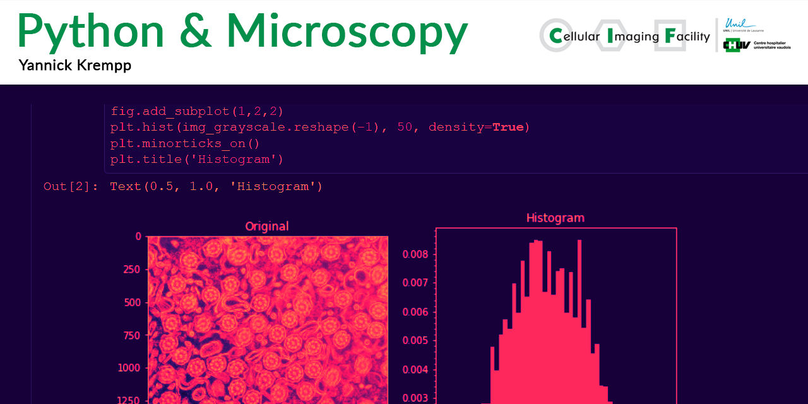

# Resources for the scientific imaging community

You will find here scripts, documents, code snippets and more than can be used to build larger applications.
This is a work in progress, and if you find bugs or errors don't hesitate to notify me !

## Resources

## 1. Documents

### 1.1. Image Analysis Notions for the Microscopist

*Concepts like digital images, DPI, scale, interpolation, using a Jupyter Notebook to illustrate them.*

[Link](https://github.com/UniversalBuilder/Image-Analysis-Notions-for-the-Microscopist)

## 2. Code

#### 2.1. Python and Microscopy

*Inspired by [Python for Microscopists](https://www.youtube.com/channel/UC34rW-HtPJulxr5wp2Xa04w/featured) Youtube channel, by [Dr Sreenivas B.](https://www.linkedin.com/in/bnsreenu/)*

[Link](https://github.com/UniversalBuilder/Python-and-Microscopy)

## 3. Fiji

## 4. Other

## 5. About me

I work as technical manager and imaging expert at the **Cellular Imaging Facility**, Lausanne, Switzerland. My focus is on helping researchers to be able to analyze the data they acquire on our instruments.
If you're curious about the facility, head to [the CIF website](https://cif.unil.ch), that I'm also webmastering.

## 6. Contact

If you wish to contact me directly, here's my info:

|             |                     Yannick Krempp                     |
|-------------|:------------------------------------------------------:|
| Position    | CIF technical manager and IT specialist                |
| Affiliation | Cellular Imaging Facility                              |
| Adress      | Rue du Bugnon 9, CH-1005, Lausanne                     |
| Office      | 212                                                    |
| Phone       | +41 21 692 52 90                                       |
| Email       | yannick.krempp@unil.ch                                 |
| Web         | https://cif.unil.ch                                    |
| LinkedIn    | https://www.linkedin.com/in/yannick-krempp/

## 7. Citing

TBD
